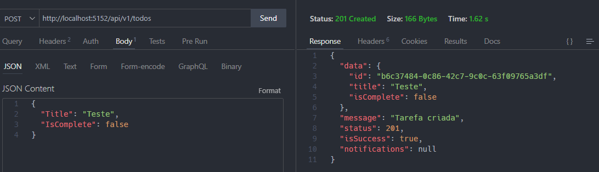
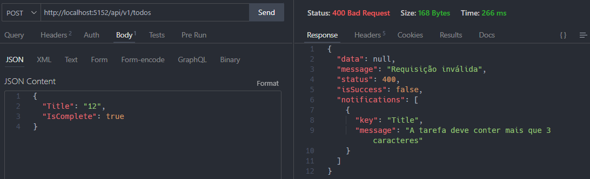

# Todo NET8 v1 - Minimal API de lista de tarefas

Esse projeto tem como finalidade servir de base para organização de projetos.

Como há muitos conceitos e regras, se faz necessário uma ordem lógica para facilitar
o uso das melhores práticas ao aplicar padrões de projeto e código limpo.

1. Crie a estrutura de arquivos separando por contextos.

```csharp
mkdir TodoNet8
cd .\TodoNet8

dotnet new sln
dotnet new classlib -o TodoApp.Core
dotnet new classlib -o TodoApp.Infra
dotnet new web -o TodoApp.Api

dotnet sln add .\TodoApp.Core
dotnet sln add .\TodoApp.Infra
dotnet sln add .\TodoApp.Api
```

1. Comece modelando o Core, definindo as Configurações, Entidades, VOs e Use Cases.
2. Depois modele a Infra para persistência no Banco de dados, mapeando e criando os Repositórios.
3. Por ultimo, modele a API. Esse será o executável que ficará rodando no servidor.
   Aqui são definidas as rotas de acesso para manipular os dados e executar possíveis migrações.

## CORE

### CONFIGURAÇÃO

1. Crie uma classe para armazenar todas as configurações padrão como banco de dados e serviços.

```csharp
namespace TodoApp.Core;
public static class Configuration
{
    // Essa configuração será recuperada futuramente pela API, de forma segura.
    public static DatabaseConfiguration Database { get; set; } = new();

    public class DatabaseConfiguration
    {
        public string ConnectionString { get; set; } = string.Empty;
    }
}
```

### OBJETOS COMPARTILHADOS

1. Crie uma entidade base para compartilhar e trabalhar com GUIDs.

```csharp
namespace TodoApp.Core.Contexts.SharedContext.Entities;

// Classe base para geração e comparação dos IDs de todas as entidades
public abstract class Entity : IEquatable<Guid>
{
    protected Entity() => Id = Guid.NewGuid();
    public Guid Id { get; }
    public bool Equals(Guid id) => Id == id;
    public override int GetHashCode() => Id.GetHashCode();
}
```

1. Como a comunicação web é realizada por meio de uma requisição e uma resposta, vamos criar uma retorno padronizado.  
   Para facilitar, utilize o pacote Flunt, gerando notificações para futuras validações.

```csharp
dotnet add package flunt
```

1. Crie um modelo para Resposta de requisições. Aqui teremos uma classe base, apenas para retorno OK ou Não OK.

```csharp
using Flunt.Notifications;

namespace TodoApp.Core.Contexts.SharedContext.UseCases;

public abstract class Response
{
    public string Message { get; set; } = string.Empty;
    public int Status { get; set; } = 400;

    // Um resumo sobre códigos Http mais comuns:

    // 200: OK. A solicitação foi bem-sucedida.
    // 201: Criado. A solicitação foi bem-sucedida e um novo recurso foi criado como resultado.
    // 400: Solicitação inválida. A solicitação não pôde ser entendida pelo servidor devido à sintaxe inválida.
    // 401: Não autorizado. A solicitação requer autenticação.
    // 403: Proibido. O servidor entendeu a solicitação, mas se recusa a autorizá-la.
    // 404: Não encontrado. O servidor não conseguiu encontrar o recurso solicitado.
    // 500: Erro interno do servidor. O servidor encontrou uma situação inesperada que o impediu de realizar a
    // solicitação

    // Se o Status estiver entre 200 e 299, IsSuccess será true. Caso contrário, será false
    public bool IsSuccess => Status is >= 200 and <= 299;
    public IEnumerable<Notification>? Notifications { get; set; }
}
```

### MODELAGEM DAS ENTIDADES

1. Crie um modelo de tarefa (Todo), herdando da classe Entity

```csharp
using TodoApp.Core.Contexts.SharedContext.Entities;

namespace TodoApp.Core.Contexts.TodoContext.Entities;

public class Todo : Entity
{
    public string? Title { get; private set; } = string.Empty;
    public bool IsComplete { get; private set; } = false;
}
```

### CASOS DE USO

#### INTERFACES PARA CONTRATOS EXTERNOS - SOMENTE A DEFINIÇÃO DOS MÉTODOS

1. Para interagir com banco de dados, crie uma interface declarando os métodos a serem usados por qualquer repositório.

```csharp
using TodoApp.Core.Contexts.TodoContext.Entities;

namespace TodoApp.Core.Contexts.TodoContext.UseCases.Create.Contracts;

public interface IRepository
{
    Task SaveAsync(Todo todo);
}
```

#### FLUXO DE PROCESSO PARA CRIAR UMA TAREFA

1. Vamos utilizar a abordagem dos casos de uso no contexto de cada entidade. Aqui, podemos definir a seguinte ordem:

Mediator Design Pattern

- Request: Definição da requisição.
- Response: Retorno com os dados enviados na requisição.
- Especificação: Obrigatoriedades da requisição.
- Manipulador: Fluxo de execução da requisição e o retorno.

1. Instale o pacote o MediatR, que facilita o trabalho de comunicação entre as partes do código.

O padrão de design **Mediator** é usado para reduzir as dependências entre os objetos e forçá-los
a colaborar apenas através de um objeto mediador.

O objetivo é simplificar a comunicação entre diferentes partes do código,
tornando-o mais fácil de entender e manter.

Resumindo, ele permite que você crie solicitações e manipuladores de solicitações que podem
ser usados para processar essas solicitações de maneira desacoplada, tornando seu código
mais fácil de entender e manter.

```csharp
dotnet add package MediatR
```

1. Crie o Request para envio da requisição ao servidor.

```csharp
using MediatR;

namespace TodoApp.Core.Contexts.TodoContext.UseCases.Create;

// O request implementa a interface IRequest do Mediator
public record Request(string Title, bool IsComplete) : IRequest<Response>;
```

1. Agora crie o Response.

```csharp
using Flunt.Notifications;

namespace TodoApp.Core.Contexts.TodoContext.UseCases.Create;

public class Response : SharedContext.UseCases.Response
{
    // Herda o construtor padrão do Response base
    protected Response()
    {
    }

    // Construtor utilizando Flunt com notificações de erros.
    public Response(
    string message,
    int status,
    IEnumerable<Notification>? notifications = null)
    {
        Message = message;
        Status = status;
        Notifications = notifications;
    }

    // Construtor com os dados do retorno da requisição
    public Response(string message, ResponseData data)
    {
        Message = message;
        Status = 201;
        Notifications = null;
        Data = data;
    }

    // Objeto com todas as propriedades do Todo
    public ResponseData? Data { get; set; }
}

public record ResponseData(Guid Id, string Title, bool IsComplete);
```

1. Agora defina as especificações do Todo. Assim é feita a validação.

```csharp
using Flunt.Notifications;
using Flunt.Validations;

namespace TodoApp.Core.Contexts.TodoContext.UseCases.Create;

public static class Specification
{
    public static Contract<Notification> Ensure(Request request)
        => new Contract<Notification>()
            .Requires()
            .IsLowerThan(
                request.Title.Length,
                160,
                "Name",
                "A tarefa deve conter menos que 160 caracteres")
            .IsGreaterThan(
                request.Title.Length,
                3,
                "Name",
                "A tarefa deve conter mais que 3 caracteres");
}
```

1. Por ultimo, temos o fluxo de requisição e resposta que é definido no Handler.
   O Handler recebe os comandos e os executa como um processo.

```csharp
using MediatR;
using TodoApp.Core.Contexts.TodoContext.Entities;
using TodoApp.Core.Contexts.TodoContext.UseCases.Create.Contracts;

namespace TodoApp.Core.Contexts.TodoContext.UseCases.Create;

// O Handler implementa a interface do Mediator que manipula a requisição e a resposta
public class Handler : IRequestHandler<Request, Response>
{
    private readonly IRepository _repository;

    // Aqui indicamos que será feita injeção de dependência do banco de dados
    public Handler(IRepository repository) => _repository = repository;

    // Fluxo para salvar uma tarefa no repositório de dados
    public async Task<Response> Handle(Request request, CancellationToken cancellationToken)
    {
        #region 01. Valida a requisição

        try
        {
            // Seguimos a técnica do Fail Fast Validation, verificando as especificações no inicio.
            // Assim é evitado processamento desnecessário em caso de dados inválidos.
            var res = Specification.Ensure(request);
            if (!res.IsValid)
                return new Response("Requisição inválida", 400, res.Notifications);
        }
        catch
        {
            return new Response("Não foi possível validar sua requisição", 500);
        }

        #endregion

        #region 02. Gera os Objetos

        // Declaração de uma variável todo, representando uma tarefa
        Todo todo;

        try
        {
            todo = new Todo(request.Title, request.IsComplete);
        }
        catch (Exception ex)
        {
            return new Response(ex.Message, 400);
        }

        #endregion

        #region 03. Persiste os dados

        try
        {
            await _repository.SaveAsync(todo);
        }
        catch
        {
            return new Response("Falha ao persistir dados", 500);
        }

        #endregion

        // Se o fluxo da execução deu certo, retorna um novo objeto como resposta
        return new Response(
            "Tarefa criada",
            new ResponseData(todo.Id, todo.Title, todo.IsComplete));
    }
}
```

## INFRA

### MODELANDO BANCO DE DADOS

Dessa forma, o código fica com baixo acoplamento e padronizado.

1. Agora Adicione o pacote do EntityFramework ao projeto de Infra

   ```csharp
   cd .\TodoApp.Infra\
   dotnet add package Microsoft.EntityFrameworkCore.Sqlite
   ```

2. Adicione a referencia do projeto Core

   ```csharp
   dotnet add reference ..\TodoApp.Core\
   ```

3. Crie uma pasta Data, modelando o AppDbContext para manipular os dados dos Todos

```csharp
using Microsoft.EntityFrameworkCore;
using TodoApp.Core.Contexts.TodoContext.Entities;

namespace TodoApp.Infra.Data;

public class AppDbContext(DbContextOptions<AppDbContext> options) : DbContext(options)
{
    public DbSet<Todo> Todos { get; set; } = null!;

    protected override void OnModelCreating(ModelBuilder modelBuilder)
    {
        modelBuilder.ApplyConfiguration(new TodoMap());
    }
}
```

1. Agora faça o De/Para com o TodoMap, representando como será criada a tabela no banco de dados.

```csharp
using Microsoft.EntityFrameworkCore;
using Microsoft.EntityFrameworkCore.Metadata.Builders;
using TodoApp.Core.Contexts.TodoContext.Entities;

namespace TodoApp.Infra.Contexts.TodoContext.Mappings;

public class TodoMap : IEntityTypeConfiguration<Todo>
{
    public void Configure(EntityTypeBuilder<Todo> builder)
    {
        builder.ToTable("Todo");

        builder.HasKey(x => x.Id);

        builder.Property(x => x.Title)
            .HasColumnName("Title")
            .HasColumnType("NVARCHAR")
            .HasMaxLength(120)
            .IsRequired(true);

        builder.Property(x => x.IsComplete)
            .HasColumnName("IsComplete")
            .HasColumnType("INTEGER")
            .HasDefaultValue(0);
    }
}
```

### IMPLEMENTANDO MÉTODOS PARA ACESSO A DADOS NO REPOSITÓRIO

1. Implemente o repositório, utilizando a interface criada no Core.

```csharp
using TodoApp.Core.Contexts.TodoContext.Entities;
using TodoApp.Core.Contexts.TodoContext.UseCases.Create.Contracts;
using TodoApp.Infra.Data;

namespace TodoApp.Infra.Contexts.TodoContext.UseCases.Create;

public class Repository(AppDbContext context) : IRepository
{
    private readonly AppDbContext _context = context;

    public async Task SaveAsync(Todo todo)
    {
        await _context.Todos.AddAsync(todo);
        await _context.SaveChangesAsync();
    }
}
```

## API

### CONFIGURAÇÃO INICIAL

1. Adicione a referência dos projetos na API. Agora podemos instanciar os objetos do Core e Infra.

```csharp
   cd .\TodoApp.Api\
   dotnet add reference ..\TodoApp.Core\
   dotnet add reference ..\TodoApp.Infra\
```

### CONFIGURAÇÃO O BUILDER

1. Agora é necessário informar quais configurações adicionais queremos que sejam carregadas com a aplicação.
   Para ficar mais organizado, crie um método de extensão do Builder.

```csharp
using Microsoft.EntityFrameworkCore;
using TodoApp.Core;
using TodoApp.Infra.Data;

namespace TodoApp.Api.Extensions;

public static class BuilderExtension
{
    // Adiciona a conexão com o banco a API
    public static void AddConfiguration(this WebApplicationBuilder builder)
    {
        Configuration.Database.ConnectionString =
            builder.Configuration.GetConnectionString("DefaultConnection") ?? string.Empty;
    }

    // Passa o contexto do banco para trabalhar com EF junto a API
    public static void AddDatabase(this WebApplicationBuilder builder)
    {
        builder.Services.AddDbContext<AppDbContext>(x =>
            x.UseSqlite(
                Configuration.Database.ConnectionString,
                b => b.MigrationsAssembly("TodoApp.Api")));
    }

    // Habilita o uso do Mediator na API
    public static void AddMediator(this WebApplicationBuilder builder)
    {
        builder.Services.AddMediatR(x
            => x.RegisterServicesFromAssembly(typeof(Configuration).Assembly));
    }
}
```

1. E agora no arquivo de inicialização, adicione os métodos.

```csharp
// Program.cs
using TodoApp.Api.Extensions;

var builder = WebApplication.CreateBuilder(args);
builder.AddConfiguration();
builder.AddDatabase();
```

### APPSETTINGS

1. Informe a conexão com banco de dados no arquivo appsettings.json.

```json
// Apenas para testes a configuração pode ficar aqui. O ideal é utilizar o dotnet Secrets para dados sensíveis.
{
  "ConnectionStrings": {
    "DefaultConnection": "Data Source=Todo.db;"
  }
}
```

### CRIANDO ESQUEMAS DO BANCO DE DADOS

1. Definida a conexão com o banco de dados, instale o pacote do EntityFramework para executar as migrações.

```csharp
dotnet add package Microsoft.EntityFrameworkCore.Design

// E agora execute a migração inicial
dotnet ef migrations add Initial
```

1. Será gerada uma pasta Migrations com as instruções do EF para criar/atualizar o banco de dados e os schemas.
   Execute a migração com o comando:

```csharp
dotnet ef database update
```

1. Se tudo der certo, será gerado um **Todo.db** dentro da pasta TodoApp.Api

### INJETANDO OS OBJETOS DO TODO E CONFIGURANDO AS ROTAS/ENDPOINTS

1. Para finalizar, crie uma classe TodoContextExtension. Aqui serão criados métodos para injetar
   o repositório e demais serviços. Também será criado método para mapear as rotas(endpoints) dos Todos.

```csharp
using MediatR;

namespace TodoApp.Api.Extensions;

public static class TodoContextExtension
{
    public static void AddTodoContext(this WebApplicationBuilder builder)
    {
        #region Create

        // Injetado o repositório usando AddTransient, gerando um novo objeto a cada requisição.
        builder.Services.AddTransient<
            TodoApp.Core.Contexts.TodoContext.UseCases.Create.Contracts.IRepository,
            TodoApp.Infra.Contexts.TodoContext.UseCases.Create.Repository>();

        #endregion
    }

    public static void MapAccountEndpoints(this WebApplication app)
    {
        #region Create

        // URL para gravar uma nova tarefa
        app.MapPost("api/v1/todos", async (
            TodoApp.Core.Contexts.TodoContext.UseCases.Create.Request request,
            IRequestHandler<
                TodoApp.Core.Contexts.TodoContext.UseCases.Create.Request,
                TodoApp.Core.Contexts.TodoContext.UseCases.Create.Response> handler) =>
        {
            // Após enviar a tarefa a ser gravada, é retornado o resultado
            var result = await handler.Handle(request, new CancellationToken());
            return result.IsSuccess
              ? Results.Created($"api/v1/todos/{result.Data?.Id}", result)
              : Results.Json(result, statusCode: result.Status);
        });

        #endregion
    }
}
```

1. Para finalizar e rodar a aplicação, adicione as configurações ao arquivo de inicialização da API (Program.cs)

```csharp
using TodoApp.Api.Extensions;

var builder = WebApplication.CreateBuilder(args);
builder.AddConfiguration(); // Adiciona o caminho da conexão com o banco e demais serviços
builder.AddDatabase(); // Adiciona o contexto do banco de dados
builder.AddTodoContext(); // Injeção de repositórios e serviços
builder.AddMediator(); // Habilita o uso do MediatR

var app = builder.Build();
app.MapTodoEndpoints(); // Mapeia as rotas com o caminho para os Endpoints

app.Run();
```

## Testando os Endpoints

1. Utilize um client Http e teste a rota para gravar uma tarefa.



Abaixo exemplo de falha, gerando uma notificação.


